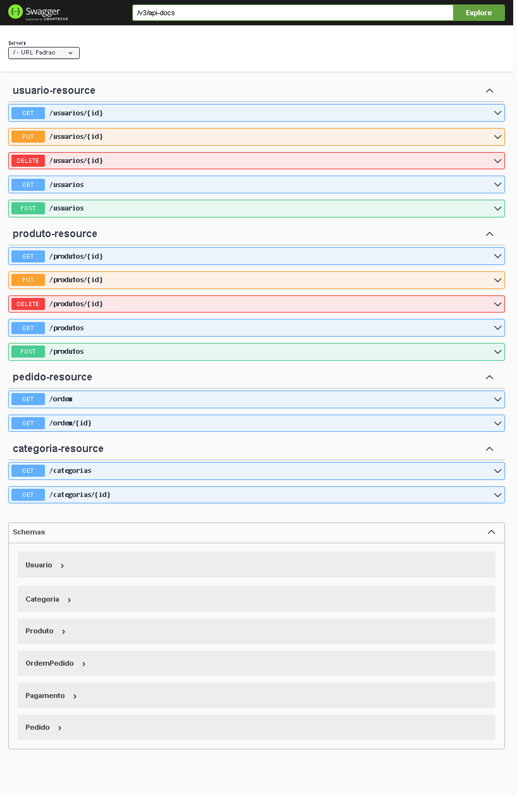

## LGS System

Api com funcionalidades Crud e tratamento de exceções,interface feita através do Swagger UI, api integrada ao railway o banco de dados PostgreSQL sendo realizado o deploy na nuvem.
Ela tem suporte para: Cadastrar, deletar, atualizar, procurar por id, listar todos os usuarios; Cadastrar, deletar, atualizar, procurar por id, listar todos os produtos;Listar todos, ouu por Id os pedidos e categorias de produtos.


## Diagrama de Classes

 ```mermaid

classDiagram
class Produto{
-Integer id
-String nome
-String descricao
-Double preco
-Set<Categoria> categorias
-OrdemDePedidos[] itens

}
class Categoria{
-Long id
-String nome
-Produto[] produtos
}

class OrdemPedido{
-OrdemPedidoPK id
-Integer quantidade
-Double preco
}

class Pedido {
-Long id
-Instant Momento
-Integer pedidoStatus
-Usuario usuário
-Pagamento pagamento
+total()double
}

class Pagamento{
-Long id
-Instant momento
-Pedido pedido
}

class Usuario{
-Long id
-String nome
-String email
-String telefone
-String senha
-List<Pedido> pedidos 

}
class StatusPedido{
    <<enumeration>>
    ESPERANDO_PAGAMENTO
    PAGO
    ENVIADO
    ENTREGUE
    CANCELADO
}

Pedido "1..N" <|.. "1"OrdemPedido
Categoria"1"  <|.. "N"Produto
Pagamento"1" <|.. "1"pedido
Usuario"1" <|.."1..N" pedido
OrdemPedido .. Pedido
OrdemPedido..Produto
StatusPedido..Pedido
```
<h4> Link da API para testa-lá : https://lgs-system.up.railway.app/swagger-ui.html</h4>


